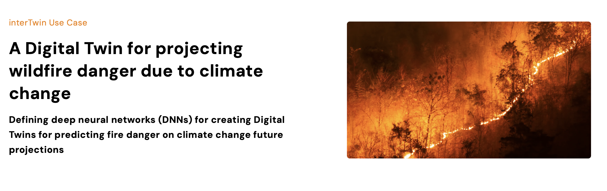

# ML4Fires

 This repository includes the code to develop and test data-driven models for Wildfire Burned Areas Prediction and Projection case studies. The main aim is to provide ML pipelines and models to investigate the Wildfires spread and propagation around the world focusing on Burned Areas.

## Overview

 Fire plays an important role in shaping ecosystems, but its long-term carbon-neutral status can be altered by climate change; in fact, climate change is the main cause of worsening fire-related weather factors and increasing global fire activity.

 The expansion of fires in evergreen forest regions could weaken their ability to act as carbon sinks, releasing stored carbon into the atmosphere and providing feedback to climate change.

 Therefore, it is crucial to improve understanding and anticipation of fires in the Earth system, particularly by assessing the likelihood of occurrence of large events, as climate change and human activity continue to influence fire regimes globally.

 Detecting and predicting wildfires is challenging and recent advances in Machine Learning (ML) provide cutting-edge modeling techniques to deal with detection and prediction tasks, offering also cost-effective and fast-computing solutions.

## Table of contents

1. [The Backbone Architecture](./docs/the_backbone_architecture.md)
1. [Data](./docs/data.md)
1. [Input Data Preparation](./docs/input_data_preparation.md)
1. [Conda Environment](./docs/conda.md)
1. [Library Structure](./docs/library_structure.md)
1. [Fires](./docs/fires.md)
1. [Run the code on a LSF cluster (with GPUs)](./docs/run_on_lsf_cluster.md)

## Contributors

[CMCC - Institute for Earth System Predictions (IESP) - Advanced Scientific Computing (ASC) Division](https://www.cmcc.it)

|      Contributor      |           Contact           |         Role        |
|          :--          |             :--             |         :--         |
|     Donatello Elia    |  <donatello.elia@cmcc.it>   |   Project Manager   |
|     Emanuele Donno    |  <emanuele.donno@cmcc.it>   |   Main Contributor  |
|     Davide Donno      |   <davide.donno@cmcc.it>    | Project Contributor |
|   Gabriele Accarino   | <gabriele.accarino@cmcc.it> | Project Contributor |
|   Giovanni Aloisio    | <giovanni.aloisio@cmcc.it>  |  Group Coordinator  |

## Acknowledgment

 This software product is developed in the context of Wildfires use case in the InterTwin Project: 

<!-- ## Future Investigations -->
